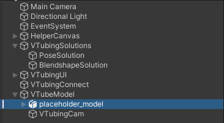

# VTubing for Linux
This project proposes a simple way to animate and use a 3D model through the webcam.

The output can be used as a virtual camera for most applications where webcams can be used.

## Usage

Open the Unity project. 
Import your 3D model then place it inside the scene under `VTubeModel/` in place of `placeholder_model`.



Adjust the `VTubing Cam` in Scene so that your model appears nicely.


You will need v4l2loopack to use the virtual camera. v4l2loopack can be installed with the following commands:
```bash
apt install v4l2loopback-dkms
modprobe v4l2loopback devices=1
```

Before starting the Game mode, copy the contents from the `ServerBuild/` to the [persistent datapath](https://docs.unity3d.com/ScriptReference/Application-persistentDataPath.html).

Plug a Webcam and start Game mode. OpenCV opens a python window and Virtual Cam opens a virtual camera which can then be accessed from any software that uses Webcam inputs.

Before building the game, change the settings from Local to Streaming Assets.


Before launching the application, copy the contents from the `ServerBuild/` to the [data path](https://docs.unity3d.com/ScriptReference/Application-dataPath.html). This is usually the folder named `xx_Data` in the same directory as the executable.

You can now launch the application and start playing with it!

## How it works

This tool relies on:
- Mediapipe for the processing of blendshapes and pose estimation
- Unity to capture the webcam, render the 3D model and move them
- [pyvirtualcam](https://github.com/letmaik/pyvirtualcam) to create a virtual camera

